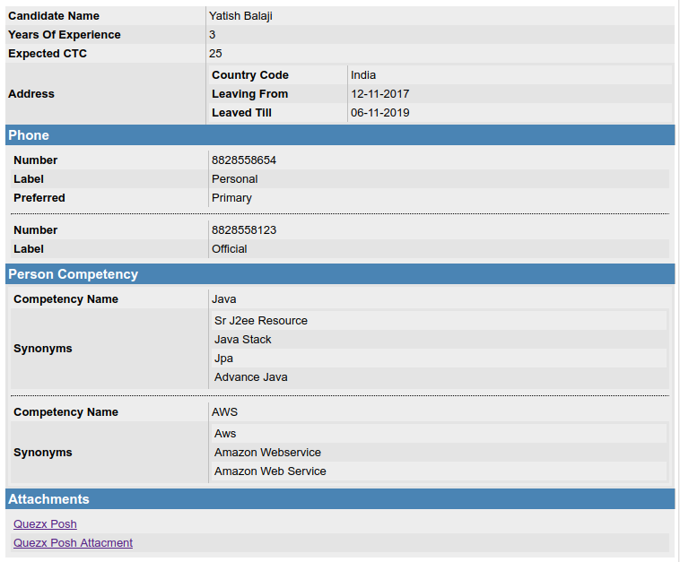

# JSON to Table (HTML)

### Install

`npm install jsontableify`

### Include

`const Jsontableify = require('jsontableify')`

### Features
* `toHTML(<json_object>)`: converts json to html code
## Usage

```
const { html } = new Jsontableify({
  headerList: ['Phone', 'Attachments', 'PersonCompetency'], // optional - will be shown as header to table
  dateFormat: 'DD-MM-YYYY', // optional- date format to be converted to if date found
  replaceTextMap: { YearsOfExperience: 'Years Of Experience' }, // optional - key will be replaced by its value
  excludeKeys: ['Current CTC'], // optional - these fields will not be displayed
}).toHtml(<JSON object>)
```

### Example
```
{
  "CandidateName": "Yatish Balaji",
  "YearsOfExperience": 3,
  "Current CTC": 10,
  "Expected CTC": 25.0,
  "Address": {
    "CountryCode": "India",
    "Leaving from": "12-11-2017",
    "Leaved Till": "2019-11-06T07:00:30.103Z"
  },
  "Phone": [
    {
      "Number": "8828558654",
      "Label": "personal",
      "Preferred": "primary"
    },
    {
      "Number": "8828558123",
      "Label": "official"
    }
  ],
  "PersonCompetency": [
    {
      "CompetencyName": "Java",
      "Synonyms": [
        "sr j2ee resource",
        "java stack",
        "jpa",
        "advance java"
      ]
    },
    {
      "CompetencyName": "AWS",
      "Synonyms": [
        "aws",
        "amazon webservice",
        "amazon web service"
      ]
    }
  ],
  "Attachments": {
    "type": "link",
    "value": [
      {
        "name": "Quezx Posh",
        "link": ["https://www.quezx.com/safeplace/"]
      },
      {
        "name": "Quezx Posh Attacment",
        "link": ["https://www.quezx.com/safeplace/"]
      }
    ]
  }
}
```
will convert into table like



> CSS for HTML code is present in `examples/toHtml.css`